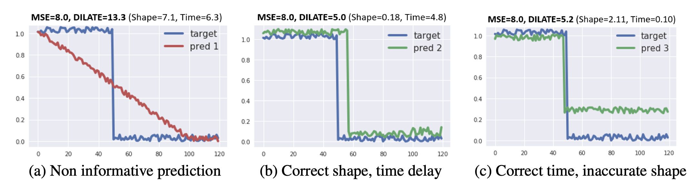

# DILATE for Time Series Forecasting Metric

This Code is based on NeurIPS 2019 paper "Shape and Time Distortion Loss for Training Deep Time Series Forecasting Models".



Unlike the original purpose of using DILATE as a loss function in the paper, the code has been modified and released to utilize it as an evaluation metric for time series forecasting.

Soft-DTW [ICML 2017] for shape mismatch + smoothed TDI(Time Distortion Index) for temporal error

If you find this code useful for your research, please cite these papers
[1](https://papers.nips.cc/paper/8672-shape-and-time-distortion-loss-for-training-deep-time-series-forecasting-models)
[2](https://proceedings.mlr.press/v70/cuturi17a.html)
:
```
@incollection{leguen19dilate,
title = {Shape and Time Distortion Loss for Training Deep Time Series Forecasting Models},
author = {Le Guen, Vincent and Thome, Nicolas},
booktitle = {Advances in Neural Information Processing Systems},
pages = {4191--4203},
year = {2019}
}


@inproceedings{cuturi2017soft,
  title={Soft-dtw: a differentiable loss function for time-series},
  author={Cuturi, Marco and Blondel, Mathieu},
  booktitle={International conference on machine learning},
  pages={894--903},
  year={2017},
  organization={PMLR}
}
```

